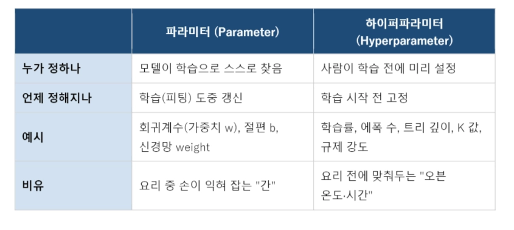
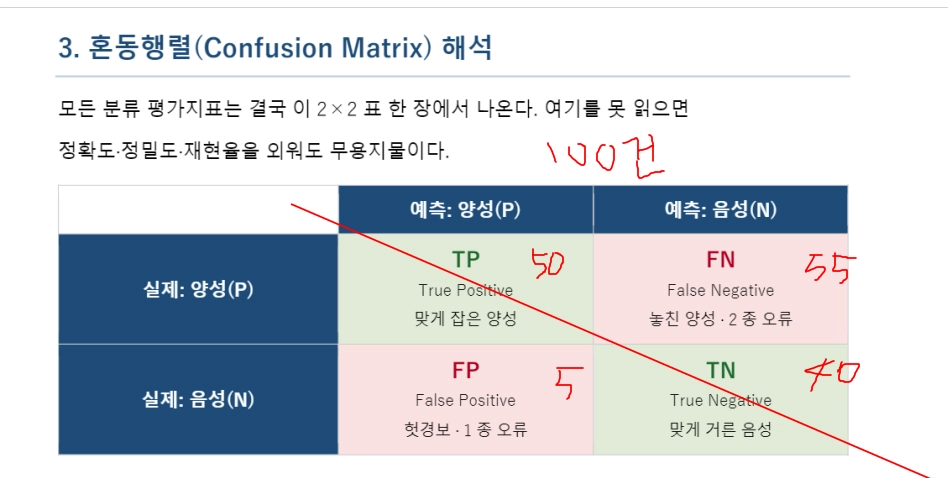
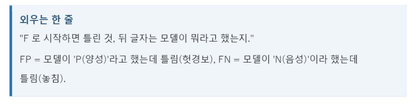

# SageMaker-Comprehend & machine learning

### 🌐 AWS Comprehend 개요

- **사전 학습된(Pre-trained) 파운데이션 모델** 기반의 자연어 처리(NLP) 서비스.
- 데이터 수집·정제·학습 과정 없이, **API 호출**만으로 비정형 텍스트(이메일, 리뷰, 로그 등)의 의미와 감정을 대량으로 분석 가능.

### 🛠️ 주요 기능 및 코드 연동 → 실습

1. **언어 감지 (Dominant Language Detection):** 다국어 문서에서 어떤 언어가 쓰였는지 감지하고 신뢰도 점수(Score) 반환. `DetectDominantLanguage` 메서드 사용.
2. **개체명 인식 (Entities):** 텍스트 안에서 사람, 조직, 날짜, 지명, 상품명 등을 추출. (예: '삼성전자' -> 조직, '서울' -> 지역 등).
3. **핵심 문구 추출 (Key Phrases):** 텍스트의 핵심이 되는 주요 문구 식별.
4. **감성 분석 (Sentiment Analysis):** 긍정(Positive), 부정(Negative), 중립(Neutral), 혼합(Mixed)의 4가지 축으로 확률적 결과 반환. `DetectSentiment` 메서드 사용.
5. **개인정보 감지 및 마스킹 (PII 자동 탐지):** 이메일, 전화번호 등 개인 식별 가능 정보(PII)의 위치(Offset)를 찾아 가려줌(Masking).
    - *Tip:* 마스킹 치환 시 문장 길이가 변하므로, 인덱스가 꼬이지 않도록 **뒤에서부터 역순(`Reverse=True`)으로 치환**하는 것이 실무적 팁.

---

# 실습 : NLP 기반 텍스트 분석 및 응용 프로젝트

## 🎯 주제

이 강의는 **자연어처리(NLP) API를 활용한 실무 프로젝트 실습**을 중심으로 진행.  5개의 실습 노트북을 통해 텍스트 마이닝, 감성 분석, 개인정보 보호, 품사 태깅, 토픽 모델링 등 실제 비즈니스에서 사용되는 NLP 기술을 체험하고 구현.

---

## 📝 핵심개념 정리

### 1. 뉴스 기사 자동화 및 스크래핑 시스템

**[1-1] 홍보팀의 기존 업무 프로세스**

- ⭐ **아침 6시 출근 후 신문, 뉴스, 영상 중 조직 관련 내용을 모두 스크랩하는 일을 수행**
- TV 채널들을 실시간 녹화하고, 조직 언급 시 즉시 녹취
- 수집된 모든 자료에 인덱스(색인)를 수동으로 부여
- 방대한 양의 미디어 자료를 관리해야 하는 비효율성 존재

**[1-2] 디지털화 및 자동화 프로젝트의 내용**

- 신문 기사, PDF, 이미지 파일 등을 디지털 형식으로 변환
- **키프레이즈(핵심 문구) 자동 추출**: 조직명(예: 숙명여대) 언급 부분 자동 감지
- 추출된 기사를 데이터베이스에 자동 저장
- 자동 요약 기능 추가로 검색 효율성 증대
- 원문은 별도로 이미지로 보관

**[1-3] 프로젝트의 실제 효과**

- ⭐ **홍보팀의 출근 시간이 6시에서 7시로 1시간 단축 가능**
- 새벽에 자동으로 처리된 신문 자료를 확인하는 방식으로 전환

**[1-4] SNS 모니터링 및 실시간 분석 시스템 (성공 사례)**

- 기업 관련 SNS 게시물 자동 수집 및 분석 시스템 구축으로 초기 시장 진입 성공
- ⭐ **실제 비즈니스 사례**: 전쟁 발발 등 주요 이슈 발생 시, SNS에서 가장 먼저 징후 포착
- 금융시장 변동을 빠르게 감지하여 매도 포지션을 선제적으로 확보한 회사가 큰 수익 창출
- First Mover(초기 진입자)들이 이 기술로 상당한 수익 창출 [03:38]

---

### 2. 실습 1: 개체명 인식(Named Entity Recognition, NER) 및 핵심 문구 추출

**[2-1] 개체명 인식(NER)의 개념 및 활용**

- 텍스트에서 사람, 조직, 위치, 제품 등 **특정 유형의 개체를 자동으로 감지 및 분류**
- API 호출 시 필요 인자: 뉴스 텍스트, 언어 코드(한국어)
- 응답 결과: 감지된 개체들의 타입(유형) 및 신뢰도 점수 포함

**[2-2] 핵심 문구(Key Phrase) 추출**

- 텍스트에서 중요한 단어나 구절 자동 추출
- ⭐ **신뢰도 점수(Score)를 기준으로 내림차순 정렬하여 가장 중요한 문구부터 표시**
- API 응답: 키프레이즈와 신뢰도 점수

**[2-3] 개체명과 핵심 문구의 통합 활용**

- 두 API를 동시에 호출하여 종합적 텍스트 분석 수행
- 개체 타입, 신뢰도 점수, 따옴표 등을 함께 처리
- 자동 뉴스 분류 및 관련 기사 수집 시스템 구축 가능 [08:35]

---

### 3. 실습 2: 감성 분석 및 개인정보 보호

**[3-1] 대상 기반 감성 분석(Target-based Sentiment Analysis)**

**정의 및 개념**

- ⭐ **특정 대상(target entity)에 대한 감정을 분석하는 기술**
- 단순 문서 전체의 감정이 아니라, 특정 대상에 대한 감정만 추출

**비즈니스 시나리오: 금융 콜센터 품질 관리**

- 콜센터 상담 전화, 카톡, 채팅 등의 텍스트 기록을 분석
- ⭐ **상담 품질 평가의 어려움**: 상담원마다 편차 존재, 대규모 콜센터는 수동 평가 불가능
- **분석 대상 구분**:
    - 제품/카드에 대한 불만
    - 앱/시스템 관련 불만
    - 상담원에 대한 불만
    - AS(애프터서비스) 관련 불만

**활용 방법**

- 각 불만 대상을 개체로 인식
- 각 대상별로 감정 점수 계산
- 부정적 감정을 보이는 부분 자동 감지

**언어 지원의 한계**

- ⭐ **현재 영어로만 지원되며, 한국어는 미지원**
- 이유: 한국어 형태소 분석의 어려움 (조사, 어미 처리의 복잡성)

**[3-2] 개인정보 식별 및 마스킹(PII - Personally Identifiable Information)**

**개인정보의 종류**

- 이름, 이메일, 전화번호, 신용카드 정보, 주소 등

**마스킹 기술의 필요성**

- ⭐ **개인정보를 별(*)이나 다른 문자로 치환하여 원본 정보 보호**
- 데이터 시스템이나 분석 과정에서 민감 정보 노출 방지

**마스킹 구현의 핵심 원리**

- ⭐ **문자열 뒤에서부터 역순으로 마스킹 수행**
    - 이유: 마스킹으로 인한 문자열 길이 변화를 방지하기 위함
    - 앞에서부터 하면 뒤의 개체 위치 정보가 틀어짐
- Reverse 옵션을 True로 설정하여 역순 처리
- offset(위치 정보)을 기반으로 정확한 치환 수행

**영어 처리와 한국어 처리의 차이**

- 영어: 띄어쓰기 기반으로 단어 구분이 명확하므로 정상 작동
- ⭐ **한국어의 문제점**:
    - "제 이름은 이적훈이에요" → "이적훈이에요" 전체를 이름으로 오인
    - 한국어는 조사/어미가 붙어 있어 형태소 분석이 필수
    - 현재는 한국어 미지원

**한국어 처리 솔루션**

- **형태소 분석기 활용**: 오픈소스 형태소 분석 도구 사용
- **LLM(대규모 언어모델) 활용**: Prompt Engineering으로 형태소 분석 수행
    - LLM에게 "다음 문장을 형태소로 분석해줘"라고 요청
    - 결과를 PII 마스킹에 활용
- **전처리**: 띄어쓰기를 명확히 하면 일부 개선 가능
    - 예: "제 이름은 이정훈 이에요" (스페이스 삽입)로 변경하면 "이정훈"만 감지 [21:46]

---

### 4. 실습 3: 품사 태깅 및 VOC 자동 분석 [22:38 - 25:29]

**[4-1] VOC(Voice of Customer)의 개념**

- ⭐ **고객의 목소리, 즉 고객 피드백, 리뷰, 컴플레인 등 모든 고객 의견**
- 기업이 제품/서비스 개선을 위해 반드시 수집하고 분석해야 할 데이터
- 현업에서 매우 중요하게 다루는 개념

**[4-2] 품사 태깅(POS Tagging)의 개념**

- 문장 내 각 단어의 품사(명사, 동사, 형용사 등)를 자동으로 분류
- VOC 분석을 위한 전처리 단계

**[4-3] 한국어 품사 태깅의 어려움**

- ⭐ **조사(은, 는, 을, 를 등)의 정확한 분류가 어려움**
- 한국어 문법의 복잡성으로 인한 오류 발생 가능

**[4-4] 실무 활용**

- 고객 리뷰에서 불만 대상 자동 추출
- 불만 패턴 분석을 통한 서비스 개선 방향 도출
- 자동화를 통한 대규모 VOC 처리 가능 [25:29]

---

### 5. 실습 4: LLM 기반 창의적 응용 및 Prompt Engineering

**[5-1] Prompt Engineering의 개념 및 중요성**

- ⭐ **사용자의 단순한 입력을 AI가 이해하고 처리할 수 있는 상세한 지시사항으로 변환하는 과정**
- 좋은 결과를 얻기 위한 핵심 요소

**[5-2] Prompt 변환의 예시: 그림 생성**

- 사용자 입력: "30대 한국 남자 그려줘"
- AI가 해석해야 할 요소들:
    - 스타일(stylish Korean man)
    - 의상(outfit)
    - 배경(background)
    - 헤어스타일 등
- ⭐ **좋은 prompt**: 이러한 요소들을 명확히 명시하여 AI가 더 정확한 결과 생성

**[5-3] 실제 성공 사례 1: AI 기반 컬러링북 자동 생성**

**비즈니스 아이디어**

- 아이들용 컬러링북을 AI로 자동 생성하여 판매

**시스템 구조**

- 한국어 입력 → (중간 번역) → 영문으로 변환
- 이유: ⭐ **토큰 절약** (한국어는 토큰 사용량이 많으므로 영문 사용)
- Agent 방식으로 분산 처리하여 여러 이미지 동시 생성
- 생성된 이미지 취합

**Prompt 설계**

- 디자이너가 주제만 제시(예: "꽃밭")
- 시스템이 자동으로 상세한 prompt 작성
- 이를 통해 AI가 일관성 있는 컬러링북 이미지 생성

**[5-4] 실제 성공 사례 2: 기사 초안 자동 작성 시스템**

**입력 단계**

- 취재 노트를 시스템에 입력

**처리 단계 (워크플로우)**

1. **요약(Summary)**: 전체 내용 축약
2. **팩트 추출(Fact Extraction)**: 객관적 사실만 추출
3. **인용구 추출(Quote Extraction)**: 중요 인용 부분 추출
4. **배경 설명(Background)**: 맥락 정보 추가
5. **사건 시간 정렬(Timeline)**: 시간순 정리
6. **부제 작성(Subtitle)**: 기사 부제 자동 생성
7. **삽화 스타일 결정(Illustration Style)**: 어울리는 이미지 스타일 선정
8. **최종 편집(Final Edit)**: 전체 내용 통합 및 검수

**특징**

- ⭐ **각 단계를 별도의 Agent나 Skill로 구성**
- 각 Agent가 특정 작업에 최적화된 prompt 사용
- 최종적으로 모든 결과를 통합하여 완성된 기사 생성

**[5-5] 토큰 절약 및 효율화 전략**

- 중간에 번역 단계 삽입
- 언어 변환을 통한 토큰 사용량 최소화
- 프롬프트를 사전에 정교하게 설계하여 재처리 최소화

**[5-6] 기존 형태소 분석의 어려움과 현재의 해결책**

- 과거: 형태소 분석기 개발에 막대한 시간과 비용 소요
- ⭐ **현재**: LLM을 활용하면 Prompt만으로 형태소 분석 수행 가능
- 결과적으로 한국어 처리의 많은 난제들이 쉽게 해결됨

**[5-7] 응용의 범위**

- 초벌 번역 → 전문가 재번역 → 에디터 3단계 편집
- 전문 번역 과정의 상당 부분을 AI로 자동화 가능 [34:08]

---

### 6. 실습 5: 토픽 모델링 및 비지도 학습 (가장 중요)

**[6-1] 지도학습(Supervised Learning) vs 비지도학습(Unsupervised Learning)**

**지도학습**

- 정답(라벨)을 제시하면서 학습
- 분류, 예측 등에 활용

**비지도학습**

- ⭐ **정답 없이 데이터 자체의 패턴을 찾아내는 학습**
- **클러스터링(Clustering)이 주요 기법**
- 유사한 데이터를 자동으로 묶는 과정

**[6-2] 토픽 모델링의 개념 및 실무 활용**

**정의**

- ⭐ **문서 또는 텍스트 데이터에서 주제(Topic)를 자동으로 찾아내는 기술**
- 비지도 학습의 대표적 예시

**실무 예시: 고객 센터 자동 분류**

- 고객이 작성한 텍스트를 자동으로 분류하도록 요청
- 시스템이 유사한 내용끼리 자동 묶음
- 예: 환불 문제, 배송 문제, 결제 문제 등으로 자동 분류
- ⭐ **사람이 미리 정해진 카테고리에 분류하는 것이 아니라, 데이터 자체에서 주제를 추출**

**[6-3] 토픽 모델링의 작동 원리**

**토픽 개수 설정**

- ⭐ **사용자가 미리 몇 개의 토픽으로 분류할지 지정** (예: 5개)
- 시스템이 자동으로 5개의 토픽으로 문서들을 군집화
- 토픽 번호: 0, 1, 2, 3, 4

**클러스터링 과정**

- 데이터를 2D 공간에 산포시킴
- 비지도 학습이므로 "정답 없이" 유사도 기반으로 자동 묶음
- 결과적으로 5개의 군집 형성

**토픽 개수 변경의 영향**

- 토픽 개수를 4에서 5로 변경하면 결과도 5개로 재조정
- 토픽 개수 선택은 사용자의 판단 문제

**[6-4] 토픽 모델링의 결과 해석**

**토픽 분포**

- 각 토픽별 문서 개수의 분포를 시각화
- 어떤 토픽이 더 많은 데이터를 포함하는지 파악

**토픽별 키워드 추출**

- 각 토픽을 대표하는 키워드 자동 추출
- 예시:
    - 토픽 0: 배송, 상자 (배송 관련)
    - 토픽 2: 품질, 원단, 마감, 제품 (제품 품질 관련)
    - 토픽 3: 상담, 직원, 답변, 만족, 고객센터 (고객 서비스 관련)
    - 토픽 4: 환불 관련

**[6-5] 새로운 데이터의 토픽 분류**

**프로세스**

- ⭐ **학습된 5개의 토픽 모델에 새로운 리뷰를 입력**
- 시스템이 자동으로 어느 토픽에 해당하는지 판정
- 각 리뷰가 어느 주제에 속하는지 분류

**[6-6] 토픽 모델링의 실무 가치**

**학술 활용: 논문 관리 시스템**

- 문제: 매일 쏟아지는 수많은 논문을 일일이 읽을 수 없음
- 솔루션:
    1. PDF 논문 → OCR(광학 문자 인식)로 텍스트 추출
    2. 추출된 텍스트에서 사용 방법론 정보 추출
    3. ⭐ **토픽 모델링으로 논문의 주제 자동 분류**
    4. 자신의 연구와 관련 있는 논문만 선별
    5. 읽을 가치가 있는 논문인지 우선순위 결정

**경제적 가치**

- 연구자의 시간 절약
- 효율적인 문헌 탐색 가능

**[6-7] 토픽 모델링의 주요 알고리즘**

- **LDA(Latent Dirichlet Allocation)**: 가장 일반적으로 사용
- **STM(Structural Topic Model)**: 추가 구조 정보 활용
- **버트 토픽(Bertopic)**: 최신 딥러닝 기반 접근
- **DTM(Dynamic Topic Model)**: 시간 변화를 추적하는 모델
- ⭐ **토픽 모델링의 기본 개념만 이해하면 각 알고리즘을 쉽게 적용 가능** [42:49]

---

## 🎓 학습 핵심 정리

### 주요 학습 목표 달성 체크리스트

✅ **NLP 기술의 이해**

- 개체명 인식, 키프레이즈 추출의 구조 파악
- 감성 분석과 개인정보 보호의 비즈니스 중요성 인식

✅ **실무 기술의 습득**

- API 호출 방식 및 응답 데이터 처리
- 마스킹 함수 구현 (역순 처리의 이유 이해)
- 형태소 분석과 LLM 활용의 연결고리 이해

✅ **고급 응용 능력**

- ⭐ **프롬프트 엔지니어링을 통한 LLM 제어**
- 토픽 모델링을 통한 비지도 학습 실무 활용
- 워크플로우 설계를 통한 복잡한 작업 자동화

✅ **비즈니스 마인드셋**

- 홍보팀 뉴스 모니터링, 콜센터 품질 관리, 고객 피드백 분석 등 실제 기업 사례 이해
- First Mover의 경쟁 우위성 인식
- 기술을 통한 비즈니스 가치 창출 능력 배양

---

# 실습

**실습 과제 구성**

- **실습 1**: 개체명 인식(NER)과 핵심 문구 추출 (To-Do 1~2번)
- **실습 2**: 대상 기반 감성 분석 및 PII 마스킹 (To-Do 1~3번)
- **실습 3**: 품사 태깅 및 VOC 분석 (To-Do 1~2번)
- **실습 4**: 프롬프트 엔지니어링 및 워크플로우 설계 (개념 학습)
- **실습 5**: 토픽 모델링 및 클러스터링 (To-Do 1~3번) - **가장 중요** [34:59]

**평가 포인트**

- 각 실습별 To-Do 완성도
- 한국어 처리의 한계를 이해하고 대안 제시 가능성
- 학습한 기술을 실제 비즈니스 시나리오에 적용할 수 있는 능력
- 특히 **토픽 모델링의 개념 이해 및 활용 방안** 중요

#### **실습 1: 언어 감지 & 감성 분석**

#### **학습 목표**

1. `detect_dominant_language`로 텍스트의 언어를 자동 감지합니다.
2. `detect_sentiment`로 문서 전체의 감성(긍정/부정/중립/혼합)을 분석합니다.
3. `batch_detect_sentiment`로 여러 문서를 한 번에 처리합니다.

**실습2: 개체 인식(NER) & 핵심 문구 추출**

- **NER**(Named Entity Recognition, **개체명 인식**

#### **학습 목표**

1. `detect_entities`로 텍스트에서 인물·장소·조직·날짜 등을 추출합니다.
2. `detect_key_phrases`로 문서의 핵심 명사구를 추출합니다.
3. 추출 결과를 시각화하고 DataFrame으로 정리합니다

**실습 3: 대상 감성 분석 & PII 감지**

#### **🔗실무로 연결하기**

`상담 로그(텍스트)` → `PII 자동 마스킹` → `(안전한) 분석용 데이터` → `품질·만족도 분석`

- 항목별 감성을 집계하면 **'어떤 기능에 불만이 집중되는지'** 가 보입니다 → 제품 개선 우선순위
- PII 마스킹 자동화로 **사람이 직접 가릴 필요가 없어** 휴먼 에러와 규정 위반 위험을 제거합니다.
- 

# 🛡️ PII 감지 (PII Detection) 란?

PII(Personally Identifiable Information)는 우리말로 '개인 식별 가능 정보(개인정보)'를 뜻합니다.

따라서 **PII 감지**란 인공지능(NLP)이 비정형 텍스트(문서, 이메일, 콜센터 녹취록 등) 속에서 특정 개인을 알아낼 수 있는 민감한 정보들을 자동으로 찾아내는 기술을 말합니다.

## 1. PII(개인 식별 정보)의 대표적인 예시

단독으로 쓰이거나, 다른 정보와 결합했을 때 '누구인지' 특정할 수 있는 모든 데이터가 포함됩니다.

- **고유 식별 정보:** 주민등록번호, 여권 번호, 운전면허 번호
- **연락처 정보:** 전화번호, 이메일 주소, 자택 주소
- **금융 정보:** 신용카드 번호, 은행 계좌 번호, 비밀번호
- **디지털 정보:** IP 주소, 로그인 ID

## 2. PII 감지는 왜 중요한가요? (실무 목적)

주로 데이터 보안과 기업의 규정 준수(Compliance)를 위해 필수적으로 사용됩니다.

- **자동 마스킹(Masking) 및 비식별화:** 고객이 쓴 리뷰나 콜센터 상담 대화록에 전화번호나 카드 번호가 포함되어 있을 경우, AI가 이를 즉시 감지하여 `010-****-1234`처럼 기호로 가려줍니다.
- **내부 권한 통제:** 권한이 없는 일반 직원이나 외부 데이터 분석가가 고객의 민감한 원본 데이터를 함부로 열람하고 유출하는 것을 방지합니다.
- **법적 리스크 예방:** 강력한 개인정보보호법 등을 준수하여 기업이 과징금을 물거나 신뢰도를 잃는 사태를 막아줍니다.

> 💡 **한 줄 요약:** PII 감지란 텍스트 무더기 속에서 **주민번호, 전화번호, 카드번호 같은 민감한 '개인정보'를 인공지능이 쏙쏙 찾아내어 가려주는(보호해 주는) 기술**입니다.
> 

**실습 4: 구문 분석 & 종합 텍스트 분석 파이프라인**

당신은 **데이터 엔지니어**입니다. 지금까지 배운 기능(언어감지·감성·개체인식·핵심문구)을 **하나의 파이프라인**으로 묶어, 고객의 소리(VOC)를 자동 분석하는 시스템을 만듭니다

#### **학습 목표**

1. `detect_syntax`로 품사(POS) 태깅을 수행합니다.
2. 앞서 배운 API를 통합하는 **종합 분석 파이프라인**을 구현합니다.
3. 분석 결과를 JSON/CSV로 저장하고 시각화 대시보드를 만듭니다.

---

# [이론] 머신러닝 기초: 모델 평가의 핵심 개념

---

> **핵심 질문:** 왜 정확도(Accuracy)만으로는 안 되는가?
> 

---

## 1. 모델링과 피팅(Fitting)

- **모델링(Modeling):** 데이터 속에 숨은 규칙을 수학적 함수로 표현하는 작업.
- **피팅(Fitting, 학습/적합):** 함수의 내부 값들을 데이터에 맞게 조정해 가는 과정 ("빈 틀"을 준비하고, 데이터를 보여주며 틀을 맞추어 깎는 것).
- **구조:** 입력($X$) $\rightarrow$ 모델 $f(X)$ $\rightarrow$ 예측 ($\hat{y}$)의 구조에서 예측이 정답($y$)에 가까워지도록 내부 값을 갱신.
- **손실 함수(Loss):** "얼마나 틀렸는가"를 재는 자.
- **학습:** 손실을 줄이는 방향으로 값을 미는 과정.

### 1-1. 과소적합 · 적정적합 · 과대적합

> 💡 **핵심:** 평가는 "학습 데이터"가 아니라 ****"처음 보는 데이터(검증 데이터)"**에서의 성능이 기준**이다.
> 
- ❌ **과소적합(Underfitting):** 모델이 너무 단순해 규칙조차 못 배운 상태. 학습·검증 성능이 모두 낮음.
- **적정적합(Good fit):** 규칙은 잡고 잡음(Noise)은 무시. 검증 데이터에서도 잘 맞는 이상적인 상태.
- ❌ **과대적합(Overfitting):** 학습 데이터를 통째로 외워버림. 학습 성능은 100%에 가깝지만 새 데이터에서는 성능이 급락함. **

**놓쳤을 때 죽는가? →"별일 아니다(음성)"라고  과소평가(2종 오류)**가 더 위험함."**

**속았을 때 망하는가? → 대단한 것이다(양성)"라고 과대평가(1종 오류)**가 더 위험함.**

> **💡 핵심 직관: 편향-분산 트레이드오프 (Bias-Variance Trade-off)**
> 
> - **편향(Bias)이 크면 = 과소적합:** 너무 뭉뚱그려 본다.
> - **분산(Variance)이 크면 = 과대적합:** 잡음까지 따라가 흔들린다.
> - 좋은 모델은 둘 사이의 균형점이며, "학습 점수"가 아니라 **"검증 점수"를 기준으로 멈출 시점**을 정한다.

## **과대적합(Overfitting) 해결 방법**

머신러닝에서 **과대적합(Overfitting)**은 모델이 학습 데이터의 소음(Noise)까지 통째로 외워버려 새로운 데이터(검증/테스트 데이터)에서 성능이 급락하는 현상으로 줄여야함.

### 1. 조기 종료 (Early Stopping) ⏱️

- **원리:** 학습이 진행될수록 학습 데이터에 대한 점수는 계속 좋아지지만, 어느 순간부터 검증 데이터의 점수는 나빠지기 시작합니다.**해결법:** "학습 점수"가 아니라 "검증 점수(Validation Score)"가 가장 좋은 임계점(최적의 균형점)에서 학습을 스스로 멈추도록 설정합니다.

### 2. 데이터 증강 및 추가 확보 (Data Augmentation) 📊

- **원리:** 모델이 데이터의 양이 적을 때 특정 패턴을 통째로 외우기 쉽습니다. 데이터의 양 자체가 많아지면 소음(Noise)에 덜 휘둘리게 됩니다.
- **해결법:** 새로운 데이터를 추가로 수집하거나, 기존 데이터를 변형(이미지 회전, 반전, 텍스트 동의어 교체 등)하여 모델이 더 다양한 규칙을 학습하도록 유도합니다.

### 3. 규제(Regularization) 적용 🔒

- **원리:** 하이퍼파라미터 설정을 통해 모델의 복잡도(가중치 크기)에 페널티를 부여하는 방법입니다.
- **해결법:**
    - **L1 규제 (Lasso):** 중요하지 않은 특징(Feature)의 가중치를 0으로 만들어 모델을 단순화합니다.
    - **L2 규제 (Ridge):** 가중치들의 크기를 전반적으로 줄여서 특정 변수에 모델이 과도하게 의존하는 것을 막습니다.

### 4. 모델의 복잡도 줄이기 (Simpler Model) 📉

- **원리:** 모델의 표현 능력이 너무 뛰어나면(예: 지나치게 깊은 신경망이나 트리 구조) 잡음까지 규칙으로 학습해 버립니다.
- **해결법:** 하이퍼파라미터 튜닝을 통해 **트리의 최대 깊이(Max Depth)를 제한**하거나, 신경망의 층(Layer) 수 및 은닉 유닛 수를 줄여 모델을 더 단순하게 만듭니다.

### 5. 드롭아웃 (Dropout) 적용 🚫 *(신경망 한정)*

- **원리:** 학습할 때마다 무작위로 일정 비율의 뉴런(노드)을 끄고 학습시키는 방법입니다.
- **해결법:** 특정 뉴런의 조합에만 의존하여 데이터를 외우는 현상을 방지하고, 매번 서로 다른 형태의 얇은 모델들을 앙상블하여 학습시키는 효과를 냅니다.

### 6. 교차 검증 (Cross Validation) 활용 🔄

- **원리:** 고정된 하나의 검증 데이터로만 하이퍼파라미터를 튜닝하면, 그 검증 데이터에만 다시 과대적합되는 문제가 생길 수 있습니다.
- **해결법:** 데이터를 $K$개의 폴드(Fold)로 나누어 번갈아가며 학습과 검증을 반복하는 **K-폴드 교차 검증**을 통해, 특정 데이터셋에 치우치지 않은 객체적이고 신뢰할 수 있는 모델 성능을 확보합니다.

> 💡 **한 줄 요약:** 과대적합을 해결하는 핵심은 **"모델을 너무 똑똑하게(복잡하게) 만들지 말고(규제/복잡도 완화) , 처음 보는 데이터에서 엇나가지 않도록 브레이크를 걸어주는 것(조기 종료/교차 검증) "**입니다.
> 

# PoC (Proof of Concept, 개념 증명) 란?

머신러닝 모델을 만들거나 새로운 IT 시스템을 도입할 때, 본 사업에 들어가기 전 **"이게 진짜 기술적으로 가능하고 효과가 있는지" 미리 소규모로 검증해보는 단계**를 뜻합니다.

### 🔍 왜 PoC를 하는가? (목적)

1. **기술적 실현 가능성 검증:** 우리가 가진 데이터와 머신러닝 알고리즘으로 목표로 하는 정확도(예: 재현율 90% 이상)를 실제로 낼 수 있는지 확인합니다.
2. **리스크 및 비용 절감:** 처음부터 수억 원을 들여 대규모 시스템을 구축했다가 실패하면 리스크가 너무 크기 때문에, 1~2달 동안 핵심 기능만 빠르게 돌려봅니다.
3. **의사결정 지원:** 경영진이나 고객사에게 "이 모델을 도입하면 실제로 이만큼의 비즈니스 가치가 나옵니다"라는 것을 데이터로 보여주며 설득하는 근거가 됩니다.

### 🛠️ PoC 프로세스 예시 (머신러닝 기준)

- **단계 1:** 데이터 샘플 추출 (전체 데이터 중 일부만 사용)
- **단계 2:** 핵심 가설 설정 (예: "**과소평가(FN)를 줄이는 모델을 만들면** 낙고 고객을 15% 방지할 수 있을 것이다.")
- **단계 3:** 프로토타입 모델 학습 및 평가 **(혼동행렬, F1-Score, AUC 등으로 빠르게 성능 확인**)
- **단계 4:** 본 사업(Production) 진행 여부 판단

---

## 2. 파라미터 vs 하이퍼파라미터

> 이름은 비슷하지만 ****"누가 정하느냐"****가 완전히 다릅니다.
> 

**| 사람이 학습 전에 미리 설정**

- **하이퍼파라미터 튜닝:** 사람이 정하는 값들의 좋은 조합을 찾는 일 (**그리드 서치, 랜덤 서치, 베이지안 최적화** 등).
- 베이지안 최적화
    
    베이지안 최적화(Bayesian Optimization)는 앞서 정리한 파라미터 vs 하이퍼파라미터 파트에서 언급된 **'사람이 정하는 값(하이퍼파라미터)의 최적의 조합'을 효율적으로 찾아주는 스마트한 탐색 알고리즘**입니다.
    
    ## 🧠 베이지안 최적화 (Bayesian Optimization) 란?
    
    하이퍼파라미터 튜닝을 할 때, 모든 조합을 다 시도해보는 그리드 서치(Grid Search)나 무작위로 찍는 랜덤 서치(Random Search)는 시간이 너무 오래 걸린다는 단점이 있습니다.
    
    베이지안 최적화는 "지난번 시도에서 점수가 낮았으니 이번엔 다른 쪽을 타겟팅하고, 점수가 높았던 주변을 더 집중적으로 파헤쳐보자!"와 같이 과거의 결과를 바탕으로 다음 탐색할 위치를 확률적으로 계산하여 똑똑하게 찾아가는 방법입니다.
    
    ### ⚙️ 핵심 구성 요소 2가지
    
    베이지안 최적화는 다음 두 가지 장치를 사용해 최적의 값을 찾아냅니다.
    
    1. **대리 모델 (Surrogate Model - 주로 가우시안 프로세스 사용)**
        - **역할:** 우리가 아직 시도해보지 않은 하이퍼파라미터 조합의 성능이 어떨지 **추측하는 지도**를 그립니다.
        - **특징:** 단순히 점수만 예측하는 것이 아니라, "이 구간은 데이터가 없어서 잘 모른다(불확실성이 높다)" 혹은 "이 구간은 확실히 점수가 높다" 같은 불확실성(Uncertainty)까지 함께 계산합니다.
    2. **획득 함수 (Acquisition Function)**
        - **역할:** 대리 모델이 그린 지도를 보고 **"다음번에는 어떤 하이퍼파라미터 값을 테스트하는 게 가장 이득일지"** 점수를 매겨 다음 목적지를 결정하는 나침반 역할을 합니다.
        - **균형(Trade-off):** 획득 함수는 항상 아래 두 가지 전략 사이에서 균형을 잡습니다.
            - **착취 (Exploitation):** 이미 검증된 알고 있는 곳 중 가장 점수가 잘 나왔던 주변을 더 세밀하게 파헤치기
            - **탐색 (Exploration):** 아직 한 번도 시도해보지 않아 불확실성이 높은 새로운 영역을 도전해보기
    
    ### 🆚 하이퍼파라미터 튜닝 방법 비교
    
    | **특징** | **그리드 서치 (Grid Search)** | **랜덤 서치 (Random Search)** | **베이지안 최적화 (Bayesian Opt)** |
    | --- | --- | --- | --- |
    | **탐색 방식** | 격자 모양으로 모든 구간 촘촘히 탐색 | 무작위(랜덤)로 탐색 | **과거 결과를 바탕으로 확률적 탐색** |
    | **속도 및 효율** | 🐌 매우 느림 (비효율적) | ⚡ 복불복이지만 그리드보다 빠름 | 🚀 **가장 빠르고 효율적** |
    | **추천 상황** | 하이퍼파라미터가 1~2개로 매우 적을 때 | 차원이 높고 범위가 넓을 때 | **모델이 무거워 한 번 학습에 시간이 오래 걸릴 때** |
    
    > 💡 **한 줄 요약:** 베이지안 최적화는 **"과거의 실패와 성공 경험(베이지안 확률)을 바탕으로, 최소한의 시도(시간 절약)를 통해 가장 좋은 하이퍼파라미터 조합을 찾아내는 스마트한 나침반"**입니다.
    > 

- ⚠️ **주의:** 반드시 **검증(Validation) 데이터로 평가**해야 함. 테스트 데이터로 튜닝하면 점수를 속이게 됨.

---

## 3. 혼동행렬(Confusion Matrix) 해석

> 모든 분류 평가지표는 이 $2 \times 2$ 표 한 장에서 나옵니다.
> 

- **대각선에 걸리는게 많을 수록** 맞음

<aside>

- **읽는 법 공식:** **`뒷 글자(P/N) = 모델의 예측` , `앞 글자(T/F) = 그 예측이 맞았는가?`**
- **TP:** 양성이라 했고 실제로 양성 (정답) → (**True Positive)**
- **TN:** 음성이라 했고 실제로 음성 (정답)
- **FP:** 양성이라 했는데 사실은 음성 (위양성 / 1종 오류 / 헛경보)
- **FN:** 음성이라 했는데 사실은 양성 (위음성 / 2종 오류 / 놓침)
</aside>

> 📌 **외우는 한 줄 팁***"F로 시작하면 틀린 것, 뒤 글자는 모델이 뭐라고 했는지."*
> 
> - **FP:** 모델이 'P(양성)'라고 했는데 틀림 = 헛경보
> - **FN:** 모델이 'N(음성)'이라고 했는데 틀림 = 놓침
> 
> 
> 

---

## 4. 평가지표: 정확도, 재현율, F1, AUC

### 4-1. [중요] 왜 정확도(Accuracy)는 중요하지 않은가?

- **이유는 단 하나:** **불균형(Imbalance) 데이터** 때문.!!!!!!
- **예시:** 암 진단 데이터에서 실제 환자가 **100명 중 1명(1%)일 때, 무조건 "정상"만 외치는 바보 모델**이 있다고 가정.

- **결론:** 정확도 99%짜리 바보 모델이 정확도 98%짜리 모델보다 훨씬 위험함. **정확도는 다수 클래스에 끌려다니기 때문에** 정작 중요한 소수 클래스(환자, 사기, 불량)의 성능을 가려버림.

### 4-2. 상황별 평가지표 선택 기준

- **데이터가 불균형할 때:** 정확도 대신 **정밀도, 재현율, F1을** 확인.
- **놓치면 큰일 나는 경우 (암 진단, 카드 사기, 화재 예방):** 👉 **재현율(Recall)** 우선.
- **헛경보가 비싼 경우 (스팸 필터, 정상 거래 차단):** 👉 **정밀도(Precision)** 우선.
- **두 지표의 균형을 한눈에 볼 때:** 👉 **F1 점수** (조화평균 특성상 낮은 쪽에 끌려가므로 한쪽만 높으면 벌점을 받음).
- **임계값과 무관한 종합 분별력을 볼 때:** 👉 **AUC** (양성을 음성보다 앞에 세우는 능력).

---

## 5. 위양성 줄이기 (1종 오류와 2종 오류)

> 두 오류는 본질적으로 **시소(트레이드오프)** 관계라 동시에 0으로 만들 수 없습니다.
> 

### 5-1. 위양성(헛경보)을 줄이는 실무 방법 5가지

1. **분류 임계값 올리기:** 임계값을 0.5에서 0.7 등으로 높여 모델이 확신할 때만 양성 판정 (가장 직접적).
2. **정밀도(Precision) 최적화:** 모델 튜닝 기준을 정확도가 아닌 정밀도(또는 $F_{\beta}$ score)로 설정.
3. **특징 및 데이터 품질 개선:** 양성과 음성을 가르는 변별력 있는 변수(Feature) 추가 및 라벨 오류 정제.
4. **비용 민감 학습 (Class Weight):** FP에 더 큰 페널티를 부여해 모델이 함부로 양성이라 예측하지 못하게 학습.
5. **PR 곡선 활용:** Precision-Recall 곡선에서 허용 가능한 재현율을 유지하는 선의 최적 임계값 채택.

> ⚠️ **공짜는 없다 (No Free Lunch)**
위양성을 줄이려고 임계값을 높이면 거의 항상 위음성(놓침)이 늘어납니다. 암 진단처럼 놓치면 끝장나는 영역에서는 위양성을 감수하고 재현율을 지켜야 합니다. 결국 정답은 도메인이 결정합니다.
> 

---

## 📌 핵심 요약

- **피팅:** 모델을 데이터에 맞춰 깎기. 핵심은 학습 점수가 아니라 과대적합을 경계하는 **검증 점수**.
- **파라미터 vs 하이퍼파라미터:** 모델이 자동으로 찾는 값 vs 사람이 학습 전에 미리 정하는 값.
- **혼동행렬:** 모든 분류 지표의 고향 ($TP, FP, FN, TN$).
- **정확도의 한계:** 불균형 데이터에서 사기 치기 좋은 지표. 소수 클래스가 중요하면 **재현율, 정밀도, F1, AUC** 필수.
- **1종 vs 2종 오류:** 위양성(헛경보)과 위음성(놓침)은 시소 관계.
- **위양성 방지:** 임계값 $\uparrow$, 정밀도 최적화, 비용 가중치 부여 등이 있으나 **놓침(FN) 증가를 각오**해야 함.

---

### 추가 공부

# 🔍 Entity (개체/엔티티)의 정의와 뜻

Entity는 직역하면 '독립된 개체', '존재'라는 뜻입니다. IT와 컴퓨터 과학에서는 데이터를 분류하고 관리할 때 "고유한 이름이나 정체성을 가진 하나의 단위(대상)"를 의미합니다.

분야별로 쓰이는 맥락을 보면 훨씬 쉽게 이해하실 수 있습니다.

## 1. 자연어 처리(NLP)에서의 Entity (개체명)

지난 강의 녹취록(AWS Comprehend)에서 나온 **Entities 추출**이 바로 이 개념입니다. 텍스트 안에서 **특정 카테고리로 분류할 수 있는 고유한 정보나 단어**를 뜻합니다.

- **개체명 인식 (NER: Entity Recognition):** 인공지능이 문장을 읽고 중요한 단어(Entity)가 무엇인지 찾아내고 분류하는 작업입니다.
- **예시 문장:** *"이재용 회장은 2026년 7월에 뉴욕을 방문했다."*
    - **이재용:** 인물(Person) Entity
    - **2026년 7월:** 날짜(Date) Entity
    - **뉴욕:** 장소(Location) Entity

> 💡 **왜 중요할까요?**
> 
> 
> 챗봇이나 검색엔진이 사용자의 질문(비정형 데이터)을 받았을 때, 핵심이 되는 의도와 대상을 파악하기 위해 문장 속 Entity를 가장 먼저 뽑아내야 하기 때문입니다.
> 

## 2. 데이터베이스(DB)에서의 Entity (엔티티)

데이터 모델링을 할 때 사용하는 개념으로, "현실 세계에서 우리가 저장하고 관리하려는 대상(사람, 장소, 사물, 사건 등)"을 말합니다. 쉽게 말해 **데이터베이스의 '테이블(Table)'이 될 대상**입니다.

- **특징:** Entity는 반드시 여러 개의 속성(Attribute)을 가집니다.
- **예시:** 학교 데이터베이스를 설계할 때
    - **Entity:** `학생`
    - **속성(Attribute):** 학번, 이름, 학과, 전화번호
    - **Entity:** `과목`
    - **속성(Attribute):** 과목코드, 과목명, 학점

## 📌 한 줄 요약

- **NLP(자연어 처리)에서:** 문장 속에서 의미를 가지는 핵심 단어 (인물, 장소, 날짜 등)
- **DB(데이터베이스)에서:** 정보를 저장하기 위해 정의한 데이터의 집합체 (테이블 구조의 대상)