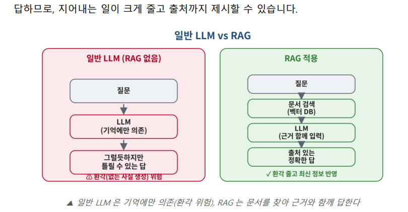

# RAG (검색 증강 생성)

## RAG 파이프라인에서의 구체적 역할

> **RAG**:  LLM 에게 답을 시키기 전에, **믿을 수 있는, 유사한 문서를 검색해** 손에 쥐여주는 것.
> 



<aside>

왜 RAG 필요한가

- 환각(Hallucination) — 모르는 것도 그럴듯하게 지어냅니다.
- 지식 한계 — 학습한 시점 이후의 일이나, 우리 회사 내부 문서는 알지 못합니다.

일반 LLM 은 아무 자료 없이 기억만으로 보는 시험 같습니다. RAG 는 오픈북 시험입니다. 답하기 전에 교과서에서 해당 페이지를 펴서 보고 답하니, 훨씬 정확하고 “몇 페이지에 있다”고 근거도 댈 수 있습니다.

</aside>

RAG는 **외부 데이터베이스**에서 질문과 관련된 정보를 **'검색(Retrieval)**'해오는 것이 핵심입니다. 이때 **임베딩**이 결정적인 역할을 합니다.

1. **문서 색인(동기화) : 지식 베이스 구축 (청킹-임베딩-DB저장)**
    1. S3 문서 업로드. Knowledge Base 생성, Sync
- 준비한 문서(PDF, 텍스트 파일 등)를 잘게 쪼갭니다**(Chunking).긴문서를 조각으로 나누기.**
    - 약간 **겹치게(overlap)**잘라 문맥 끊기지않게
    - 청킹을 잘하는게 관건.
- 쪼갠 텍스트 조각들을 **임베딩 모델**을 통해 모두 숫자로 바꿉니다(벡터화).
- 이 숫자들을 **벡터 데이터베이스(Vector DB)에 저장**해 둡니다.
1. **질의 단계 : 사용자 질문 변환**
    - 사용자가 질문을 던지면, 그 질문 역시 **동일한 임베딩 모델**을 사용해 숫자로 바꿉니다.
2. **유사도 검색 (Similarity Search)**
    - 질문 벡터와 Vector DB에 있는 문서 조각 벡터들을 비교합니다.
    - 수학적 계산(예: 코사인 유사도)을 통해 "질문 좌표와 가장 가까운 거리에 있는 문서 조각"을 찾아냅니다.
3. **답변 생성 : 콘솔 테스트**
    - 찾아낸 가장 연관성 높은 문서 조각을 LLM(거대 언어 모델)에 프롬프트와 함께 넘겨주어 정확한 답변을 생성하게 합니다.


에폭, batch 사이즈 등 조절


사내지식 등 데이터를 **검색**(retrieval) → 벡터 **증강**(augmented) → generation **생성**


전부 벡터들로 텍스트 임베딩(Amazon Bedrock), 가장 비슷한 벡터 검색


- **Bedrock**으로 : **텍스트 데이터 →** 다차원의 **벡터 (임베딩)**

**RAG(검색 증강 생성, Retrieval-Augmented Generation)** 개념에서 

**임베딩(Embedding)**은 컴퓨터가 인간의 언어(텍스트)를 **이해하고 비교할 수 있도록** **수학적인 벡터(숫자 배열)로 변환하는 과정**을 의미합니다.

쉽게 말해, "텍스트의 의미를 담은 다차원 좌표로 바꾸는 것


임베딩을 거치면, 의미가 유사한 단어나 문장은 벡터 공간에서 서로 가까운 거리(좌표)에 위치하게 됩니다


**의미적 검색(Semantic Search)의 열쇠:** 단순히 '같은 글자'를 찾는 키워드 검색과 달리, "오늘 날씨 어때?"와 "지금 밖에 비 오니?"처럼 **표현은 다르지만 의미가 통하는 문장**을 찾아낼 수 있게 해주는 기술이 바로 임베딩

e.g. 강아지 = 댕댕이 연관성 높은 단어를 찾아낼 수 있게 해줌.

• 임베딩이 정확할수록 RAG 시스템이 질문에 딱 맞는 올바른 지식을 데이터베이스에서 잘 찾아올 수 있습니다.


c.f. 법률 ai 하비

---

# 용어 정리


Bedrock ≈ Azure OpenAI,
OpenSearch/S3 Vectors ≈ Azure AI Search

- Q. 문서가 자주 바뀌면요?
RAG 의 가장 큰 장점입니다. S3 의 문서를 **갈아 끼우고 Sync(동기화)만 다시** 누르면 **임베딩, 벡터 변환되어 DB반영되**며 끝입니다. **모델 재학습이 전혀 필요 없습니다.**
- 프로그래밍에서 **시맨틱(Semantic)**이란 코드 조각의 의미를 나타낸다. 
함수명을 단순히 **A**('10000')로 만들게 되면 아무 의미도 가지지 않는 함수 처럼 보일수 있다.
하지만 **inputWallet**('10000')처럼 의미적 가치를 지닌 시맨틱 네이밍

---

### Graph DB

Graph DB(그래프 데이터베이스)는 데이터를 점, 선, 면 같은 **그래프 구조**로 저장하고 관리하는 데이터베이스입니다.

기존의 관계형 데이터베이스(RDBMS)가 데이터를 **테이블(행과 열) 형태**로 저장하고 테이블 간의 관계를 테이블 조인(Join)으로 해결했다면, 그래프 DB는 데이터 자체와 그 데이터 간의 **'관계(Relationship)'를** 처음부터 직접 연결된 형태로 저장.

## 📌 그래프 DB의 핵심 구성 요소

그래프 DB는 크게 3가지 요소로 데이터를 표현합니다.

- **노드 (Node / Vertex):** 개체(Entity)를 나타냅니다. RDBMS의 '행(Row)'에 해당합니다. (예: '이지현'이라는 사람, '컴퓨터공학과'라는 학과 등)
- **관계 (Edge / Relationship):** 노드와 노드 사이의 연결 선을 뜻하며, **방향성**과 **종류**를 가집니다. 그래프 DB에서는 이 관계가 물리적인 포인터로 연결되어 있어 조인 연산 없이 즉시 참조할 수 있습니다. (예: 이지현 — `[소속되어_있음]` $\rightarrow$ 컴퓨터공학과)
- **속성 (Property):** 노드와 관계가 가질 수 있는 상세 정보(Key-Value 쌍)입니다. (예: 이지현 노드의 속성 $\rightarrow$ `{학번: 20230427, 전공: "백엔드"}`)

## 💡 RDBMS vs 그래프 DB 차이점

| **특징** | **관계형 DB (RDBMS)** | **그래프 DB (Graph DB)** |
| --- | --- | --- |
| **데이터 모델** | 테이블 (표 형태) | **네트워크 (노드와 간선)** |
| **관계 표현** | 외래키(FK) 및 조인(Join) 연산 | **물리적 연결** (포인터 직접 참조) |
| **조인(Join) 성능** | 테이블이 커지고 깊어질수록 성능 급감 | 데이터 규모와 상관없이 관계 추적 속도가 일정함 |
| **유연성** | 스키마가 엄격하여 구조 변경이 어려움 | 스키마가 유연하여(Schema-less) 즉시 확장 가능 |

## 🎯 왜 쓸까? 주요 장점과 트렌드

1. **압도적인 '관계 탐색' 성능**
    - "A의 친구의 친구가 좋아하는 영화는?" 같은 다단계 관계(Multi-hop)를 RDBMS에서 찾으려면 테이블을 대여섯 번 JOIN 해야 해서 데이터가 많아질수록 서버가 멈추거나 성능이 바닥을 칩니다. 반면 그래프 DB는 연결된 선(포인터)만 쭉 따라가면 되기 때문에 데이터가 수억 건이 있어도 순식간에 찾아냅니다.
2. **유연한 스키마 설계**
    - 새로운 유형의 데이터나 관계가 추가되어도 기존 테이블 구조를 마이그레이션할 필요 없이, 그냥 새 노드와 선을 긋기만 하면 됩니다. 변경이 잦은 현대 백엔드 아키텍처에 매우 유리합니다.

## 🏢 실무 활용 시나리오

- **추천 엔진:** 소셜 미디어(SNS)의 "알 수도 있는 친구 추천", 커머스의 "이 상품을 구매한 다른 고객이 함께 본 상품" 등 연관 관계 기반 추천.
- **이상 금융 거래 탐색 (Fraud Detection):** 신용카드 도용이나 금융 사기단이 여러 명의 명의와 계좌를 복잡하게 엮어 자금을 세탁할 때, 그 고리(패턴)를 실시간으로 추적 및 감지.
- **지식 그래프 (Knowledge Graph) 및 AI/RAG:** 엔터티 간의 개념적 관계를 정의하여 LLM(대형 언어 모델)이 더 똑똑하게 답변할 수 있도록 지식 베이스 구축 (최근 GenAI 트렌드에서 **Graph RAG**로 매우 각광받고 있음).
- **물류 및 네트워크 경로 최적화:** 서버 인프라의 의존성 맵핑이나 물류 이동 경로 계산.

## 🛠️ 주요 플랫폼 및 Query 언어

- **Neo4j:** 현재 전 세계에서 가장 널리 쓰이는 표준적인 오픈소스 그래프 DB입니다. SQL과 유사하지만 그래프 탐색에 특화된 **Cypher**라는 직관적인 쿼리 언어를 사용합니다.
- **AWS Neptune:** AWS에서 제공하는 완전 관리형 그래프 데이터베이스 서비스로, 대규모 엔터프라이즈 환경이나 하이브리드 클라우드 아키텍처에서 많이 채택합니다.

> **Cypher 쿼리 맛보기 (예시):**
> 
> 
> ```
> // '이지현'이 학생인 '컴퓨터공학과' 노드를 찾아 연결하는 쿼리
> MATCH (s:Student {name: "이지현"}), (d:Department {name: "컴퓨터공학과"})
> CREATE (s)-[:BELONGS_TO]->(d)
> ```
>