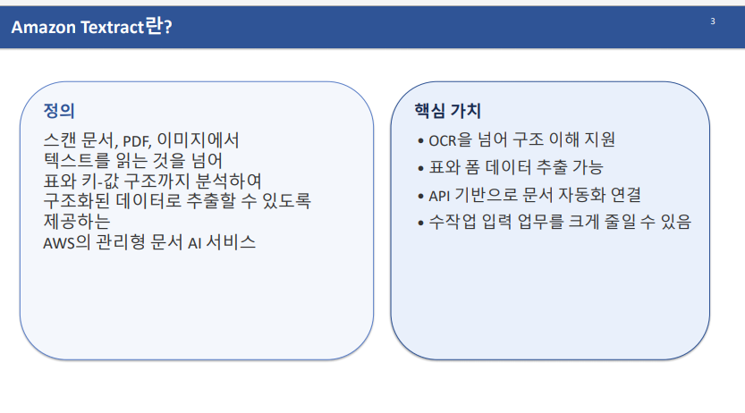

# AWS Textract 개념 & 실습

- Amazon Textract를 활용한 문서 AI
- 문서 **OCR을 넘어 구조화된 정보 추출까지** 기능 → **처리 흐름, 아키텍처, 활용 시나리오**를 설명

Service 레벨로 Rekognition, Compregend와 같은 위치.

OCR과 달리 Textract는 텍스트만 읽는 것이 아닌, 구조(표, 키-값 구조)를 함께 분석 → 문서 자동화에 바로 연결하기 좋음

## 주요 기능 4가지

1. **Text**
    
    Rekognition
    

**2.Forms**

1. **Tables**
    1. 표 데이터 추출

1. **Queries**
    
    원하는 필드만 빠르게 추출
    

## 결과 : Textract 결과 데이터 이해

## 실제 활용

## 다른 접근

매우 특수한 문서 형식 처리 등 고도 커스텀이 필요할땐 직접 모델을 만들어 이용.

## 전체 정리

---

## [실습1] AWS AI 서비스(Rekognition, Textract) 실습

## 🎯 주제

- **AWS AI 서비스 실습**: Rekognition API를 통한 보호장비(PPE) 감지 및 Textract를 통한 문서 AI 기능 학습
- **IT 업계 현황 공유**: 2008년부터 현재까지의 IT 업계 업무 문화, AI 도구 활용, 클라우드 환경 변화에 대한 실무 경험 전달
- **실무 설계 원칙**: API 활용 방법, 아키텍처 구성, 비용 최적화 전략 이해

---

## 📝 핵심개념 정리

### 1. **Rekognition API - 보호장비(PPE) 감지**

#### [1-1] 보호장비의 분류 및 감지

- ⭐ **보호장비 타입 3가지**
    - **헤드커버(Head Cover)**: 안전모, 헬멧 등 머리 보호 장비
    - **페이스커버(Face Cover)**: 마스크, 보글 등 얼굴 보호 장비
    - **핸드커버(Hand Cover)**: 안전장갑 등 손 보호 장비
- **신체 부위(Body Part)**: 보호장비가 적용된 신체 위치 정보 포함
- API 호출을 통해 이미지에서 인원 감지 및 착용 장비 식별

#### [1-2] 준수율(Compliance) 계산

- 개인이 적절하게 보호장비를 착용하고 있는지 판별
- 각 인원별로 안전 컴플라이언스 여부 판정

#### [1-3] API 활용 방식

- 모든 AWS AI 서비스는 **동일한 방식으로 API 호출 및 Response 수신**
- Response는 JSON 형식으로 반환되며, 각 API에 따라 구조가 상이
- 반환된 데이터를 적절히 조작하여 실제 비즈니스에 활용

---

### 2. **Textract - 문서 AI 서비스**

#### [2-1] Textract의 정의 및 특징

- ⭐ **일반 OCR과의 차별성**
    - 일반 OCR: 단순히 텍스트만 읽음, 문서 구조 이해 약함
    - **Textract**: 텍스트 추출을 넘어서 **문서 구조도 함께 분석** → 표, 키-값 쌍, 질문 기반 검색 지원
- 스캔된 문서, PDF, 이미지에서 텍스트와 데이터를 자동으로 추출

#### [2-2] Textract의 주요 기능 4가지

- **Detect Document Text**: 문서 내 텍스트를 라인 및 단어 단위로 추출
- **Form(양식) 분석**: 키(항목명)와 값(데이터)의 쌍을 추출
    - 예) "주민등록번호: 123456-1234567" → 키는 "주민등록번호", 값은 "123456-1234567"
- **Table(표) 분석**: 문서 내 표 구조를 인식하고 행·열별로 데이터 추출
- **Query(쿼리) 기능**: 자연어 질문 기반으로 문서에서 필요한 정보를 찾음
    - 예) "주민등록번호가 뭔지 찾아줘" → AI가 자동으로 해당 값 반환

#### [2-3] 응답(Response) 구조의 주요 정보

- **위치 정보(Bounding Box)**: 추출된 텍스트가 이미지의 어느 위치에 있는지 좌표로 제공
- **블록(Block) 구조**: API가 반환하는 기본 데이터 단위
    - 필드별로 의미 있는 데이터를 구조화하여 전달
- 비즈니스 시스템의 필드와 직접 맵핑 가능하도록 설계

#### [2-4] 문서 처리 방식 2가지

- **동기식 처리**: 단일 이미지 분석 (즉시 결과 반환)
- **비동기식 처리**: 다중 페이지 또는 대용량 문서 분석
    - 요청 → Background 처리 → 완료 알림 또는 주기적 확인 → 결과 조회
    - 대규모 문서(예: 10페이지 이상 PDF)에 유용
    - 실무에서 주로 이 방식 사용 (요청 큐에 순차적으로 처리)

#### [2-5] 일반적인 문서 AI 아키텍처(파이프라인)

1. **저장**: 이미지/PDF를 S3 같은 스토리지에 업로드
2. **처리**: Textract API 호출 (분석 요청)
3. **저장**: 추출된 데이터를 데이터베이스에 저장
4. **활용**: 비즈니스 시스템에서 데이터 사용

---

### 3. **문서 AI 활용 시 고려사항**

#### [3-1] 문서 품질(Document Quality)

- ⭐ **결과에 가장 영향을 미치는 요소**
- 기울어진 문서, 해상도 부족, 흐릿한 이미지 → 결과 품질 저하
- 문서 품질 최소화를 위한 비즈니스 설계 필요

#### [3-2] 문서 유형 및 일관성

- **양식 일관성**: 특정 형식의 문서로 제한하는 것이 설계의 중요 원칙
    - 다양한 포맷 → 각 형식별로 분기 처리 필요 → 복잡성 증가
    - 해결책: "반드시 PDF만 제출" 등으로 문서 형식 제한
- **문서 다양성**: 여러 유형 문서 처리 시 추가 로직 필요

#### [3-3] 검증(Validation) 및 사람 검토

- ⭐ **AI 서비스는 완벽하지 않음** (엉뚱한 데이터 추출 가능)
- 중요한 데이터는 사람의 검토 프로세스 필수
- 설계 단계에서 사람의 개입이 필요한 구간을 명확히 정의

#### [3-4] 보안 고려사항

- 민감한 정보(개인정보, 금융 정보) 다룰 시 접근 통제 필수
- 금융권: 민감성으로 인해 On-Premise 환경 선호, Cloud 사용 제한적

#### [3-5] 비용 최적화 전략

- ⭐ **비용 관리가 실무에서 중요한 이슈**
- **계층적 API 활용**:
    - 1단계: 저렴한 API(일반 텍스트 인식)로 문서 **분류**
    - 2단계: 필요한 문서만 고급 API 사용 (자연어 쿼리, 표 분석 등)
- 예) 100개 문서 중 진단서 50개만 식별 후, 그 50개만 고급 API 사용
- 중복 호출 방지, 불필요한 분석 제거

---

### 4. **실무 적용 시나리오 및 활용 분야**

#### [4-1] Textract 활용 분야

- **금융 분야**: 신규 계좌 개설 서류, 심사 서류 자동화
- **공공 기관**: 대량의 정부 서류 자동 처리
- **기업 운영**: 영수증 자동화 (사진 촬영 → 자동 항목 정리 → 경비 처리 자동화)
- **지식 관리**: 기존 문서의 데이터화 및 검색 가능 형태로 변환

#### [4-2] 한계 및 대안

- ⭐ **완벽하지 않은 이유**: 모든 문서가 표준화되지 않음
- 매우 특수한 문서 형식이나 커스텀 요구사항:
    - AWS 기본 API로는 부족
    - **직접 머신러닝 모델 개발 필요** (API 활용이 아닌 Custom Model)
- 실무 분석: 일반적 문서 vs 특수한 문서 구분 후 적절한 접근법 선택

---

### 5. **IT 업계 현황 및 트렌드**

#### [5-1] IT 업계 업무 문화의 변화 (2008년 vs 현재)

**2008년(암흑시기)**

- ⭐ **야근이 문화**: 야근을 하지 않으면 이상한 사람 취급
- 3D 업종 이미지로 부정적 인식 확산
- 토요일도 근무하는 회사 다수
- 매우 타이트한 일정 관리, 과도한 업무량

**현재(개선된 분위기)**

- 주 5일제 정착으로 토요일 휴무 확대
- 워라밸(Work-Life Balance) 개념 도입
- 업무 강도는 여전히 높지만, 계획적 관리로 개선
- 소문으로 인한 경쟁률 감소 → IT 분야 입학 난이도 하락

#### [5-2] AI/LLM의 실무 영향

- ⭐ **AI 도구 필수화**: 사용하지 않으면 경쟁력 상실
- **기술 격차의 축소**: 예전의 "에이스 개발자 = 10명분 업무" 구조 약화
- **기초 지식의 중요성**: AI 도구 활용도 기초 이해 필수
    - 도구 활용만으로는 한계 (초반 효과적이나 문제 발생 시 해결 불가)
    - 기초 → 적절한 질문 설정 → 빠른 원인 파악 가능

#### [5-3] 광범위한 경험의 중요성

- **깊이 vs 넓이**: 한 분야 집중 vs 다양한 분야 경험
- 다양한 경험 → 여러 Insight 얻음 → 장기적으로 도움
- AWS 등의 다양한 AI 서비스 실습 가치

---

### 6. **클라우드 환경 현황**

#### [6-1] 클라우드 활용 현황

- ⭐ **규모에 따른 차이**:
    - 작은 기업: 클라우드 집중 사용 (비용 효율)
    - 대기업: 하이브리드 환경 선호 (기존 온프레미스 + 클라우드)

#### [6-2] 온프레미스(On-Premise) 유지 이유

- 클라우드 등장 전 기존 서비스 운영 중
- 기존 장비로 충분한 성능 제공
- 전환 비용(리소스) 고려

#### [6-3] 업무 특성에 따른 선택

- **금융권**: 민감한 정보 취급 → 온프레미스 환경 선호
    - 금감원 감시/감사 대비, 규제 충족 필요
- **신규 서비스**: 개인정보/금융 정보 불포함 시 → 클라우드 우선

#### [6-4] 주요 클라우드 플랫폼

- **AWS**: 가장 오래된 서비스 → 표준화 → 한국에서 가장 광범위하게 사용
- **Azure(MS)**: 2번째 선택지, 기업급 지원 강화
- **GCP(Google)**: 3번째 선택지
- **Naver Cloud**: 국산 클라우드이나 안정성 문제 존재, 정부/규제 이유로 일부 사용

#### [6-5] 클라우드 플랫폼 선택 요인

- 초기 서비스 선택이 장기 운영에 영향
- 대기업: 2개 이상 플랫폼 비교 사용 → 가격 협상
- 클라우드 컨설팅/구축 회사 성장 (10년 전부터 현재까지 호황)

---

### 7. **IT 업계 보안 및 인프라 현황**

#### [7-1] 개발 환경의 보안 강화 추세

- ⭐ **개인 노트북 작업 제한**: 점차 증가 중
- **가상머신(VM) 할당**: 회사에서 지급한 VM 환경에서만 개발
    - 로컬 PC: 문서 편집 등 기본 기능만 허용
    - 개발/작업은 모두 VM에서 진행

#### [7-2] 데이터 유출 방지 기술

- VM 환경에서 생성된 코드/문서는 **외부 반출 불가** (보안 장치)
- 승인 없이 데이터 외부 유출 차단
- 인터넷 접근 제한 회사도 존재

#### [7-3] AI 도구 사용 제한

- 보안 강화 회사: ChatGPT, LLM 도구 접근 차단
- 결과: 개발자는 수동 코딩에 의존 → 기본기 중요성 재강조
- 성능 저하 감수하면서도 보안 우선시

---

## ✍️ 실습 과제

### 실습 과제 (TODO 1번 ~ 7번)

- **TODO 1번**: Head Cover, Case(Face) Cover 보호장비 감지 실습
- **TODO 2-3번**: 보호장비 유형별 검출 및 신체 부위별 착용 여부 파악
- **TODO 4번**: 보호 컴플라이언스 판정 (인원이 안전하게 착용했는지 판별)
- **TODO 7번**: Textract 통합 프로젝트 (참고자료로 제공)

### Textract 실습 커리큘럼 (0번 ~ 7번 노트북)

- **실습 예정**: 1번 ~ 6번 노트북 (핵심 기능만 다룸)
- **준비물**:
    - 강의 교재 제공 Jupyter Notebook 파일
    - 'images' 폴더에 제공 이미지(jpg) 및 PDF 파일 필수
    - 동일 경로에 폴더 구조 설정

### 핵심 개념 확인

- Textract의 블록(Block) 구조 이해 필수
- 주요 필드 정의 및 사용법 학습
- 다양한 API 사용법 습득 (Detect Document Text vs Analyze Document)

---

## 💡 추가 학습 포인트

### 중요한 기초 개념

- AWS API 호출 및 JSON Response 처리 방법의 일관성
- 다양한 API를 배워야 광범위한 문제 해결 가능
- 기초 지식이 있어야만 AI 도구를 제대로 활용 가능

### 실무 설계의 핵심

- 기술적 가능성만이 아닌 **비용, 보안, 검증** 종합 고려
- 문서 AI는 강력하나 만능이 아님 → 분석 후 맞는 도구 선택
- 단순 API 활용이 아닌 **전체 아키텍처 관점**의 설계 중요

---

## [실습2] AWS AI 서비스를 활용한 문서 분석 및 OCR 실습

## 🎯 주제

이 강의는 **AWS Textract를 중심으로 한 문서 분석 및 OCR(광학문자인식) 기술의 실무 활용**을 다룹니다. 단순 텍스트 추출을 넘어 폼/테이블 분석, 자연어 기반 정보 추출, 영수증/신분증 분석 등 다양한 문서 처리 시나리오를 실습하며, 실제 비즈니스에서 이러한 기술을 어떻게 설계하고 적용할 수 있는지를 학습합니다.

---

## 📝 핵심개념 정리

### 1. AWS Textract 개요

**[1-1] Textract의 정의**

- AWS에서 제공하는 문서 분석 AI 서비스
- 이미지와 PDF 파일에서 텍스트, 표, 폼 데이터를 자동으로 추출
- 기계학습 기반으로 정확도가 높음

**[1-2] 주요 특징**

- ⭐ **다양한 블록 타입 지원**: 텍스트, 라인(줄), 워드(단어), 테이블, 폼 등으로 세분화된 데이터 추출 가능
- 추출된 데이터에 신뢰도(confidence) 값 제공으로 정확성 판단 가능
- 바운딩 박스(Bounding Box)를 통해 이미지 상에서 추출된 정보의 위치 표시 가능

---

### 2. 주요 추출 기능별 분류

**[2-1] 텍스트 기반 추출 (Document Analysis)**

- **라인(Line) vs 워드(Word)**
    - 워드: 개별 단어 단위의 추출
    - 라인: 한 줄 전체의 텍스트 추출
    - 두 가지 방식 모두 신뢰도 값과 함께 반환됨 [02:04]
- 블록 관계 탐색: 텍스트의 계층적 관계(부모-자식 관계) 이해 가능

**[2-2] 폼(Form) 분석**

- ⭐ **키-밸류(Key-Value) 형식으로 데이터 추출** [08:22]
- 예: "이름: 홍길동" → "이름"(키) / "홍길동"(밸류)로 구조화
- 설문지, 신청서, 계약서 등 폼 형태의 문서에 최적화

**[2-3] 테이블 분석**

- 표 구조를 행(Row)과 열(Column)로 인식하여 셀 단위 데이터 추출
- Pandas 데이터프레임 형식으로 변환 가능
- 비정형 표 형식도 어느 정도 인식 가능

**[2-4] 쿼리 기반 정보 추출 (Queries) - 가장 혁신적 기능** [18:23]

- ⭐ **자연어 질문을 통해 문서에서 필요한 정보 직접 추출** [18:23]
- AI가 의도를 이해하고 해당하는 정보를 자동으로 찾아 반환
- 규칙 기반(Rule-Based) 추출의 한계 극복
    - 기존: 특정 키워드 위치, 숫자 패턴(예: 주민등록번호 6자리-7자리) 등으로 정규식 코드 작성
    - 새로운 방식: 자연스러운 질문으로 정확하게 추출 가능 [21:08]
- 다중 오탐지 문제 해결: 날짜 데이터처럼 문서에 여러 번 나타나는 정보를 정확하게 구분 가능 [21:08]
- 알리아스(Alias) 지정으로 결과 식별 용이

**[2-5] 특화 문서 분석**

- **영수증/인보이스 분석**: 품목, 금액, 날짜, 총액 등 회계 정보 자동 추출 [27:34]
- **신분증 분석**: 여권, 운전면허증 등에서 개인 정보 추출 [32:25]
    - 마스킹(Masking) 처리로 민감한 정보 보호 가능 [32:25]

---

### 3. Textract 사용 시 주의사항

**[3-1] 언어 지원 제한**

- ⭐ **현재 한글 미지원** - 영문 및 일부 언어만 지원 [05:39]
- 한글 지원 시점 미정이지만, 향후 추가될 가능성 있음 [06:37]
- 한글 필요 시 대안: MS Azure 또는 Google Cloud Platform 활용 권장 [06:37]

**[3-2] 쿼리 작성 팁**

- 영어로 질문 작성할 때 정확도 높음 [19:16]
- 질문이 구체적일수록 정확한 결과 획득
- 문서 형식과 내용에 맞게 질문 커스터마이징 필요 [20:15]

---

### 4. 클라우드 플랫폼별 특성 비교

**[4-1] 각 클라우드의 강점**

- **AWS**: OCR 및 문서 분석 기능 포괄적, 하지만 한글 미지원 [06:37]
- **Microsoft Azure**: 한글을 포함한 더 많은 언어 지원 [06:37]
- **Google Cloud Platform (GCP)**: 빅데이터 처리에 특화
    - BigQuery 서비스로 대량의 데이터 분석에 우수한 성능 [07:28]
    - 대규모 데이터 처리 회사에서 많이 선택 [08:22]

---

### 5. 문서 처리 설계의 중요성

**[5-1] 비즈니스 적용 시 핵심 요소** [11:20]

- ⭐ **설계가 전체 성공의 핵심** [11:20]
- API의 특성과 제약 조건 파악
- 처리할 문서의 유형과 특성 분석
- 적절한 기능 선택 (단순 텍스트 추출 vs 폼 분석 vs 쿼리 기반 추출)

**[5-2] 실무 개발자의 업무 구성** [12:11]

- ⭐ **실제 개발 시간은 전체의 절반 미만** [12:11]
- 비즈니스 분석 (분석)
- 시스템 설계 (설계)
- 코딩 (개발)
- 유지보수 및 최적화 (최적화)
- 클라우드 인프라 및 비용 관리 [13:02]

**[5-3] 문서 유형별 추출 방식 선택** [22:06]

- 복잡하고 비정형 문서 → 쿼리 기반 추출 (Queries)
- 단순하고 구조화된 폼/표 → 폼/테이블 분석 기능
- 매우 단순한 문서 → 규칙 기반 추출 또는 텍스트 추출로 충분

---

### 6. PDF 문서 처리

**[6-1] PDF 처리의 특수성** [40:31]

- 다중 페이지 PDF 지원
- ⭐ **페이지별로 이미지(PNG)로 변환 후 처리**
- 변환된 이미지 각각에 대해 Textract API 호출
- 전체 페이지를 순차적으로 처리하여 최종 결과 병합

---

### 7. 클라우드 서비스 인프라 관리

**[7-1] SageMaker 도메인 관리**

- ⭐ **비용 발생 방지를 위해 사용 완료 후 반드시 삭제 필요**
- Jupyter Lab, Notebook 등 모든 인스턴스 먼저 중지(Stop)
- 도메인 삭제 전 User Profile 및 Space(공간) 모두 삭제 필수

**[7-2] AWS 서비스 특성**

- 장애 발생 시 보상 정책 있음 (요금 감면 등)
- 다양한 리소스 생성 시 사용 후 체계적 삭제 필수
- S3, Knowledge Base 등도 모두 삭제 필요

---

### 8. 기술 선택 시 고려사항

**[8-1] 코딩 능력이 전부가 아님**

- IT 분야는 다양한 경로 존재
- 서비스 기획, 설계 등도 중요한 역할
- 코딩이 어렵다면 다른 분야 탐색 권고

**[8-2] AWS 사용 시 주의점** 

- AWS는 버그 및 예상 외 동작이 상대적으로 많은 편
- 한글 지원 약함
- 다른 클라우드(Azure, GCP)는 비교적 안정적

---

## ✍️ 실습

### 실습 과제 구성 (6개 실습)

**[1] 기본 텍스트 추출 (TODO 1-4)**

- 이미지 파일 지정 및 텍스트 추출
- 블록 타입별 개수 분석
- 라인에서 텍스트 추출 및 신뢰도 확인
- 블록 관계(Relationship) 탐색
- 참고: AWS Textract 공식 데모 페이지에서 추가 학습 가능

**[2] 폼/테이블 분석 (TODO 1-5)**

- 폼 데이터를 키-밸류 형식으로 추출
- 테이블 데이터를 데이터프레임으로 변환
- 바운딩 박스를 이용한 시각화
- 결과를 CSV 파일로 저장 [15:54]

**[3] 쿼리 기반 정보 추출 (TODO 1-5)**

- 자연어로 작성한 질문을 통해 정보 추출 [18:23]
- 영어로 질문 작성 필수 [19:16]
- 간단한 질문부터 시작하여 복잡도 증가 [20:15]
- 실무에서 규칙 기반 추출의 한계를 극복하는 방식 학습 [21:08]

**[4] 영수증/인보이스 분석 (TODO 1-5)**

- 샘플 영수증 이미지 분석 [28:02]
- 회계 정보 자동 추출 [29:30]
- 실무 적용: 회계부서에서 활용 가능성

**[5] 신분증 분석 (TODO 1-?)**

- 여권, 운전면허증 등 신분증 정보 추출 [32:25]
- 마스킹 처리를 통한 민감 정보 보호 [32:25]
- 개인정보 처리 방식 학습

**[6] 다중 페이지 PDF 처리 (최종 실습)**

- 2페이지 이상의 PDF 문서 처리 [40:31]
- 페이지별 이미지 변환 [42:56]
- 순차적 처리 및 전체 결과 수집
- S3 업로드 없이 로컬에서 처리하는 방식

**[7] 리소스 삭제 (필수 마지막 실습)**

- ⭐ **비용 청구 방지 위해 반드시 수행**
- SageMaker 인스턴스 중지
- User Profile 삭제
- Space(공간) 모두 삭제
- 도메인 삭제
- S3, Knowledge Base 등 모든 생성 리소스 삭제

---

## 📌 강조사항

1. **한글 미지원의 현실성**: 현재 Textract는 한글을 지원하지 않으므로 실제 한국 문서 처리에는 Azure 고려 필수 
2. **설계의 중요성**: 단순 코딩 능력보다 문서 특성을 파악하고 적절한 기능을 선택하는 설계 능력이 더 중요 
3. **쿼리 기반 추출의 혁신성**: 자연어를 통해 복잡한 패턴 매칭 없이 정확한 정보 추출 가능 - 기존 규칙 기반 방식의 대안 
4. **리소스 관리의 필수성**: 클라우드 서비스는 사용 후 반드시 리소스를 삭제해야 의도치 않은 비용 청구 방지 가능 
5. **AWS의 불안정성**: 타 클라우드 대비 버그나 예상 외 동작이 많으므로 대체 솔루션 고려 필요 

---

## 🎓 실무 적용 시나리오

- **회계 자동화**: 영수증/인보이스에서 자동으로 비용 정보 추출
- **신분증 검증**: KYC(Know Your Customer) 프로세스 자동화
- **계약서 분석**: 폼/테이블 분석으로 핵심 조항 자동 추출
- **문서 분류**: 쿼리 기반 추출로 문서 특성 파악 후 자동 분류

---